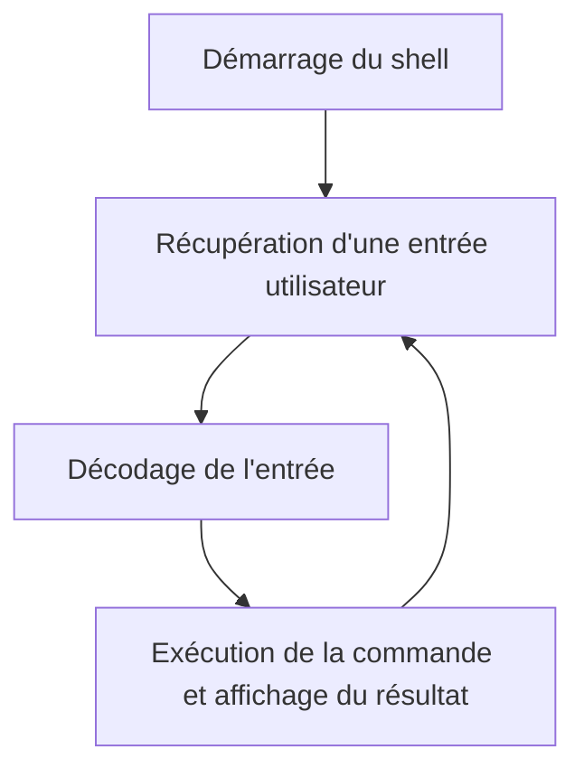

# Cahier des charges `nutsh`

## Participants

* Rémi Bourgeon
* Rodolphe Houdas
* Alexandre Thiroux

## Objectif du projet

Nous voulons créer un *shell* pour système Linux.
Ce programme fourni une invite de commande pour lancer des processus, et des fonctions primitives (_shell builtins_) qui ne sont pas des programmes externes mais des fonctions essentielles implémentées directement dans le programme du _shell_.

Un *shell* doit permettre de se déplacer au sein d'une **arborescence de fichier**, de gérer des **variables d'environnement** et d'exécuter des programmes.

## Objectifs pédagogiques

* Réaliser un programme orienté objet en C++
* Utiliser des librairies externes : savoir inclure et utiliser une librairie dans son programme, comme dans la vraie vie
* Utiliser des outils de programmation en équipe (`git` pour la gestion de version, un outil de _build_, un gestionnaire de package)

## Liste des primitives à implémenter (shell builtins)

* `cd`
* `pwd`
* `exit`
* `echo`
* `printf`
* `jobs`
* `fg`
* `export`/`unset`
* Substitution d'une commande shell par son résultat quand on utilise les accents graves ou `$(commande)`
* Gestion des strings litérales (avec _simple quotes_) et strings non litérales qui remplacent les variables précédées par `$`

Il s'agit ici d'une liste limitée des primites qui nous paraissent les plus importantes. Si besoin, celle-ci sera étendue avec d'autres primitives issues de [cette page](https://www.ibm.com/support/knowledgecenter/ssw_aix_72/com.ibm.aix.osdevice/bourne_shell_builtin_cmd_list.htm)

## Fonctionnement de l'interface



1. Démarrage du shell
2. Récupération d'une entrée utilisateur
3. Décodage de l'entrée
4. Exécution de la commande et affichage du résultat
5. Retour à 2

## Gestion du _prompt_

Le *prompt* est la chaîne de caractères qui précède l'invite de commande. Dans les _shell_ existants il est souvent **configurable**.

Présentation classique d'un _prompt_ :

```txt
<nom_utilisateur>@<nom_hote> <chemin>
```

### Option de configuration du _prompt_

* Date
* Couleur
* Gestion résultat commande précédente (succès / erreur)

## Exécution de commandes externes

Les commandes externes sont exécutées dans un autre processus (ou un thread ? à déterminer) et le résultat du processus est récupéré par le shell après exécution.

## Gestion des jobs

* Liste des jobs
* *Foreground* : tâche qui prend le contrôle du shell
* *Background* : tâche de fond
* Stop
* *Kill*
* Récupérer une tâche de fond (`fg`)
* Send f to background (Ctrl + Z)

## Gestion des pipes

Deux commandes (ou plus) sont exécutées en parallèle, connexion du flux de sortie d'une commande au flux de sortie de l'autre.
Deux processus et un _pipe_ (appel système) sont créés, on passe le _file descriptor_ comme flux de sortie au premier et comme flux d'entrée au second.

* Dans un premier temps seulement deux commandes
* Puis généralisation pour autant de commandes possibles

## Gestion des redirects (a.k.a `>`, `<`, `>>`, `<<`)

La redirection des flux d'entrées et de sortie doit être gérée avec ces caractères spéciaux. Les simples chevrons écrasent le fichier de base, les doubles chevrons ajoutent des lignes à la fin du fichier (_append_).

Les flux de sortie et d'erreur marchent avec les chevrons vers la droite (`>`) et doivent être différenciés par `1` et `2` en opérande de gauche du chevron.

```bash
> cat fichier 1> autrefichier
```

## Gestion de l'environnement

**On veut gérer un maximum de choses avec les appels système**.

La liste suivante d'appels systèmes décrit le nom de la fonction et la page du manuel POSIX où trouver la documentation associée :

* `getenv(3)`/`setenv(3)`
* `execvp(3)`
* `fork(2)`
* `waitpid(2)`
* `getcwd(3)`
* `chdir(3)`
* `pipe(2)`
* `dup(2)` pour les redirections (pas pareil qu'un _pipe_)

Par exemple pour `chdir` on peut trouver la documentation avec `man 3 chdir`

## Gestion des variables

Les variables sont propres à un processus _shell_. Elles seront gérées dans un dictionnaire.
À la fermeture du _shell_, les variables sont perdues. Afin de pouvoir les conserver il est nécessaire d’effectuer un `export MYVAR`, qui exportera la variable dans les variables d’environnement.
